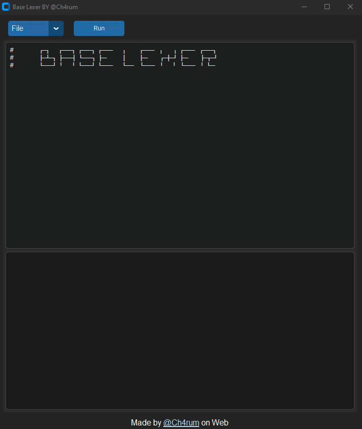

# 🐍 Base-Lexer  🐹 

<p align="center">
  <br>
</p>
<div align="center">
  <a href="#-description"><kbd>Description</kbd></a>&ensp;
  <a href="#-features"><kbd>Features</kbd></a>&ensp;
  <a href="#-examples-of-use"><kbd>Examples of Use</kbd></a>&ensp;
  <a href="#-requirements"><kbd>Requirements</kbd></a>&ensp;
  <a href="#-usage--build"><kbd>Usage & Build</kbd></a>&ensp;
  <a href="#-contributions"><kbd>Contributions</kbd></a>
</div>

## 👾 Description

A cross-platform (Windows/Linux) lexical and syntactic analyzer written in $Python$, which recognizes a subset of the language similar to $Go$.
This project was developed for educational purposes to learn how compilers work, token generation, and abstract syntax tree*(AST)* construction.

> [!WARNING]
> This project is for academic learning purposes only.  
> It's **not intended** to replace the official Go compiler or cover all of its features.

## 👨‍💻 Features

- **Lexical Analysis:** Tokenizes Go-like code with comprehensive error reporting.
- **Syntactic Analysis:** Parses tokens into an Abstract Syntax Tree (AST).
- **GUI Interface:** User-friendly interface built with CustomTkinter.
- **Error Handling:** Detailed error messages with context and line/column information.
- **Cross-Platform:** Works on both Windows and Linux systems.

## 📝 Examples of Use

Just write and run it!  

```go
// Example 1
package main

func main() {
    var n int = 3;

    // Example of for loop and if-else
    for (i := 0; i < n; i = i + 1) {
        if i == 1 {
            print("One");
        } else {
            print("Other:", i);
        }
    }
}

/* Example 2
   Code between comments should be ignored
*/
package main

func main() {
    flag := true;
    peoples := {
        "age": 30,
        "name": "Ana"
    };
    if peoples["age"] >= 18 {
        print("[+] Of legal age");
    }
}

// Example 3
package main
func main() {
    if age < 18 && flag {
        print("You are underage and have permission");
    } else if age < 18 && !flag {
        print("You are underage and do not have permission");
    } else {
        print("You are of legal age");
    }
}
```

## 📦 Requirements

To run this code, you need to install some dependencies in your Python environment. To do this, you can use `pip` or `pacman`(on Arch Linux).

- Python 3.7+
- Dependencies:
    - `customtkinter `
    - `tk`
    - `ply`

For Linux, you should use the `Installer.sh` script to install everything automatically:

```sh
curl -sL https://raw.githubusercontent.com/ch4rum/Base_Lexer/master/Installer.sh | bash
```

For manual installation:

```sh
pip install -r requirements.txt
```

## 🚀 Usage & Build

Simply clone the repository and run the main script:

```sh
cd Base_Lexer
python main.py
```

## 📧 Contributions

Feel free to fork this repository and propose improvements or additional features through pull requests. 


